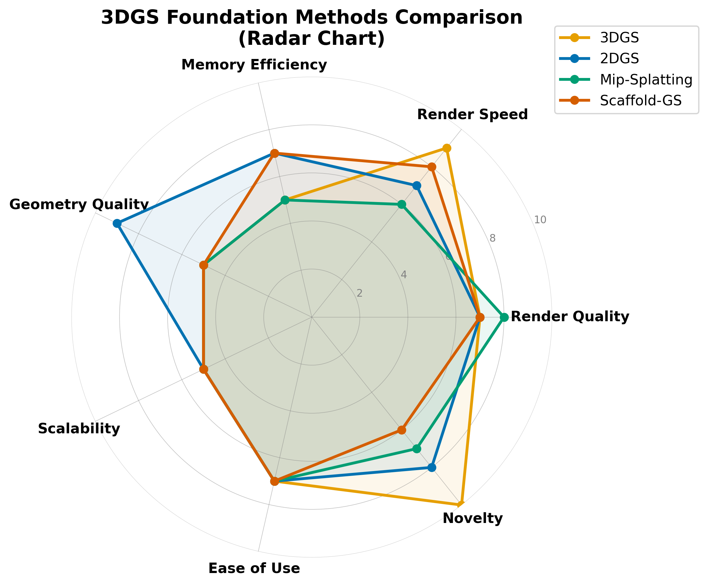
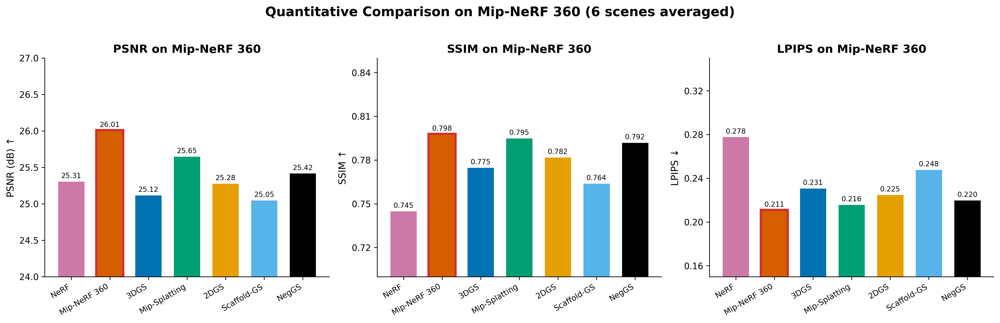
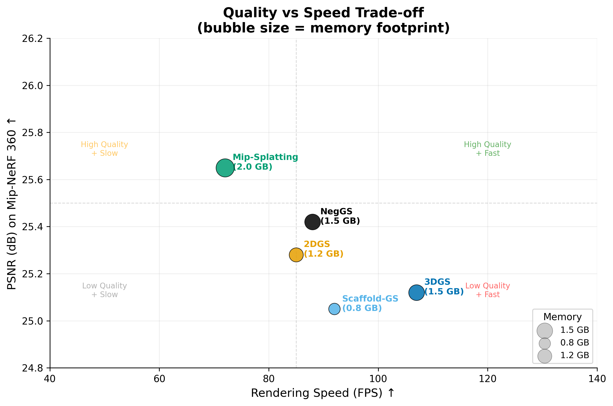
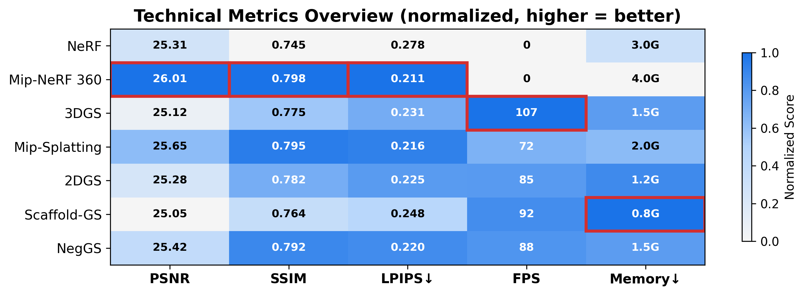

<div align="center">

If you like it, please ⭐️ star this repo! 
        
# Awesome Gaussian Skills

### The First Skill Pack for 3D Gaussian Splatting & Computer Graphics Research

**Plug-and-play AI Agent skills for OpenClaw / Claude Code / Cursor — read papers, compare methods, review code, design experiments, all in natural language.**

[](LICENSE)
[](skills/)
[]()
[]()
[](CONTRIBUTING.md)

[English](README.md) | [中文](README_CN.md)

</div>

> 📢 This project is maintained with Agent assistance. If you find broken links or incorrect information, please open an Issue.

---

## Why This Project?

3D Gaussian Splatting (3DGS) is one of the most active research areas in computer vision and graphics, with **500+ papers published since 2023**. Yet the AI Agent ecosystem has a glaring gap:

> **ClawHub has 13,000+ skills, but almost ZERO for 3D reconstruction / computer graphics.**

Meanwhile, every 3DGS researcher faces the same repetitive tasks:

| Pain Point | Frequency |
|-----------|-----------|
| Reading and summarizing new papers | Daily |
| Comparing method designs (GS vs 2DGS vs NegGS vs ...) | Weekly |
| Reviewing implementation code for bugs | Per submission |
| Designing ablation experiments | Per paper |
| Migrating NeRF methods to 3DGS | Per project |

**Awesome Gaussian Skills** solves all of these — just describe what you need in natural language, and the AI Agent handles the rest.

---

## Features

- **8 Research-Grade Skills**: Paper reading, method comparison, code review, experiment planning, NeRF-to-3DGS migration, CAD/Mesh-3DGS bridge, CG paper writing, and research visualization (radar charts, timelines, comparison tables)
- **Zero Setup**: Pure SKILL.md files — no Python packages, no dependencies, no installation. Just drop into your Agent's skill directory
- **Cross-Platform Compatible**: Works with [OpenClaw](https://github.com/openclaw), Claude Code, Cursor, Windsurf, and any Agent that supports the SKILL.md / CLAUDE.md format
- **Domain Expert Knowledge**: Built-in knowledge base covering 184+ 3DGS variants across 21 categories, with domain-specific terminology conventions
- **Actively Maintained**: Daily updates to track the latest arXiv papers and community developments

---

## Quick Start

### Option 1: OpenClaw

```bash
# Clone this repo
git clone https://github.com/jaccen/Awesome-Gaussian-Skills.git
cd Awesome-Gaussian-Skills

# Copy all skills to OpenClaw skills directory
cp -r skills/* ~/.openclaw/skills/

# Restart OpenClaw
openclaw restart
```

### Option 2: Claude Code / Cursor

```bash
# Clone to your project
git clone https://github.com/jaccen/Awesome-Gaussian-Skills.git

# Copy the skills you need into your project's CLAUDE.md directory
cp -r skills/3dgs-paper-reader/SKILL.md .claude/
cp -r skills/3dgs-code-reviewer/SKILL.md .claude/
```

### Option 3: One-Click Install Script

```bash
curl -sSL https://raw.githubusercontent.com/jaccen/Awesome-Gaussian-Skills/main/scripts/setup.sh | bash
```

---

## Skills Overview

### 1. `3dgs-paper-reader` — Paper Reading & Summarization

**Read any 3DGS paper and extract structured insights in seconds.**

```
You: "帮我读一下这篇论文 2401.01345，总结核心方法和实验结果"
Agent: [Extracts method name, core innovation, architecture, 
        training strategy, datasets, metrics, and key findings]
```

**Capabilities:**
- Parse arXiv papers (by ID or URL) and local PDFs
- Extract method architecture, loss functions, training details
- Generate structured summaries with tables
- Identify novelty and limitations

### 2. `3dgs-method-compare` — Method Comparison Engine

**Compare any 3DGS variants across 10+ dimensions.**

```
You: "对比 ***和 **** 的核心差异"
Agent: [Generates comparison table across: primitive representation,
        opacity handling, color mechanism, frequency modeling,
        geometric boundary, training strategy, etc.]
```

**Capabilities:**
- Multi-method side-by-side comparison
- 10+ comparison dimensions (rendering formula, primitive, loss, speed, ...)
- Identify design trade-offs
- Built-in knowledge of 184+ methods

### 3. `3dgs-code-reviewer` — Implementation Code Review

**Catch common 3DGS implementation bugs before submission.**

```
You: "审查我的 3DGS CUDA 渲染 kernel，看看有没有性能问题"
Agent: [Checks: alpha compositing order, tile-based rendering,
        CUDA memory coalescing, gradient computation, etc.]
```

**Capabilities:**
- Review CUDA kernels for correctness and performance
- Check rendering pipeline (differentiable rasterization, alpha blending)
- Validate loss function implementations
- Common bug pattern detection (53+ known patterns)

### 4. `3dgs-experiment-planner` — Experiment Design Assistant

**Design rigorous experiments that satisfy top-venue reviewers.**

```
You: "我要写一篇关于高频边界建模的3DGS论文，帮我设计实验"
Agent: [Recommends datasets, baselines, metrics, ablation matrix,
        rendering comparisons, and efficiency analysis plan]
```

**Capabilities:**
- Dataset and baseline recommendation (tailored to your method)
- Ablation study matrix design
- Metric selection guidance (PSNR/SSIM/LPIPS/FID/CHF/etc.)
- Efficiency analysis framework
- Visualization plan for paper figures

### 5. `nerf-to-3dgs-migrator` — NeRF-to-3DGS Migration Guide

**Migrate your NeRF method to 3DGS with step-by-step guidance.**

```
You: "我的 NeRF 方法用了 hash encoding + deformable field，
     怎么迁移到 3DGS？"
Agent: [Provides migration plan: feature encoding → per-Gaussian 
        attributes, deformation → position/rotation offsets, 
        with code templates]
```

**Capabilities:**
- Component-level migration analysis
- Code templates for common migration patterns
- Identify incompatibilities and workarounds
- Performance comparison estimation

### 6. `cad-mesh-3dgs` — CAD, Mesh & 3DGS Bridge

**Navigate the mesh↔3DGS pipeline, CAD reverse engineering, and surface extraction.**

```
You: "我训练了一个3DGS模型，怎么提取高质量的mesh？"
Agent: [Recommends SuGaR or 2DGS pipeline, provides TSDF extraction
        steps, Marching Cubes parameters, and quality evaluation code]
```

```
You: "如何把CAD模型（STEP格式）转换为3DGS表示？"
Agent: [Provides mesh→Gaussian conversion pipeline, covariance 
        initialization from mesh normals, and curvature-aware sampling]
```

**Capabilities:**
- Mesh→3DGS conversion (sampling, initialization, optimization)
- 3DGS→Mesh extraction (SuGaR, 2DGS, TSDF+Marching Cubes)
- CAD reverse engineering pipeline (mesh→B-rep via primitive fitting)
- Hybrid representation analysis (MaGS, UniMGS, 2DGS)
- Geometry quality evaluation (Chamfer Distance, F-Score, Normal Consistency)
- Debugging common mesh-Gaussian conversion issues

### 7. `cg-paper-writing` — CG Paper Writing Assistant

**Write publication-ready papers for CVPR/ICCV/ECCV/SIGGRAPH/TVCG.**

```
You: "帮我写一篇关于 3DGS的论文引言，要和 ****GS 做对比"
Agent: [Generates academic introduction with proper structure,
        domain terminology, and argumentation flow]
```

**Capabilities:**
- Venue-specific writing conventions (CVPR vs SIGGRAPH vs TVCG)
- Domain terminology database (3DGS, NeRF, rendering, geometry)
- De-AI-ification (remove AI writing patterns)
- Section-by-section writing (Abstract → Introduction → Related Work → Method → Experiments → Conclusion)
- Mathematical notation conventions

### 8. `3dgs-visualizer` — Research Visualization

**Generate publication-quality charts for 3DGS research: radar charts, comparison tables, and method timelines.**

```
You: "画一个雷达图对比 3DGS、2DGS 和 NegGS 在各维度的表现"
Agent: [Generates radar chart with 7 dimensions: Render Quality,
        Speed, Memory, Geometry, Scalability, Ease of Use, Novelty]
```

```
You: "生成3DGS领域的时间线演进图，从2023年到2026年"
Agent: [Creates chronological timeline showing 40+ methods across
        14 categories with citation-weighted node sizing]
```

**Capabilities:**
- Radar charts for multi-dimensional method comparison (7 default dimensions, customizable)
- Visual performance/efficiency comparison tables with color-coded highlighting
- Method evolution timelines with category lanes and citation-weighted sizing
- Dual output: static (PDF/PNG via matplotlib/seaborn) and interactive (HTML via plotly)
- 3 pre-built presets: Landscape Overview, Category Deep Dive, Paper Submission Package
- Publication-quality styling with Okabe-Ito colorblind-safe palette

---

## Architecture

```
Awesome-Gaussian-Skills/
├── skills/
│   ├── 3dgs-paper-reader/       # Paper reading & summarization
│   │   └── SKILL.md
│   ├── 3dgs-method-compare/     # Method comparison engine
│   │   └── SKILL.md
│   ├── 3dgs-code-reviewer/      # Code review for 3DGS implementations
│   │   └── SKILL.md
│   ├── 3dgs-experiment-planner/ # Experiment design assistant
│   │   └── SKILL.md
│   ├── nerf-to-3dgs-migrator/  # NeRF-to-3DGS migration guide
│   │   └── SKILL.md
│   ├── cad-mesh-3dgs/          # CAD, Mesh & 3DGS bridge
│   │   └── SKILL.md
│   ├── 3dgs-visualizer/        # Research visualization (radar, table, timeline)
│   │   └── SKILL.md
│   └── cg-paper-writing/        # CG paper writing assistant
│       └── SKILL.md
├── references/
│   ├── 3dgs-methods-overview.md # Index (184+ methods across 21 categories)
│   ├── methods-core.md         # Core methods (Foundation→Dynamic)
│   ├── methods-semantic-editing.md # Semantic, Editing, Material, Avatar
│   └── methods-systems-apps.md # Systems, Applications, Cross-Domain
├── scripts/
│   └── setup.sh                 # Quick install script
├── Test/
│   ├── radar_comparison.pdf/png/html       # Radar chart: 3DGS vs 2DGS vs Mip-Splatting vs Scaffold-GS
│   ├── metrics_bar_comparison.pdf/png      # PSNR / SSIM / LPIPS grouped bar chart
│   ├── quality_vs_speed_scatter.pdf/png    # Quality vs Speed bubble chart
│   ├── metrics_heatmap.pdf/png             # Normalized metrics heatmap
│   └── metrics_dashboard.html              # Interactive 4-in-1 dashboard (plotly)
├── README.md
├── README_CN.md
├── CONTRIBUTING.md
└── LICENSE
```

Each skill follows the **SKILL.md standard** (YAML frontmatter + Markdown instructions), compatible with:

- **OpenClaw** (ClawHub ecosystem)
- **Claude Code** (`.claude/` directory)
- **Cursor** (`.cursor/rules/`)
- **Windsurf** and other AI Agent frameworks

---

## Visualization Samples

Samples generated by `3dgs-visualizer` — see [`Test/`](Test/) for full-resolution files.

| Radar Chart (Method Comparison) | Metrics Bar Chart (PSNR/SSIM/LPIPS) |
|:---:|:---:|
|  |  |

| Quality vs Speed Scatter | Normalized Metrics Heatmap |
|:---:|:---:|
|  |  |

Interactive versions (hover for details): [`radar_comparison.html`](Test/radar_comparison.html) | [`metrics_dashboard.html`](Test/metrics_dashboard.html)

---

## Covered Methods (Partial)

| Category | Methods |
|----------|---------|
| Foundation | 3DGS, 2DGS, Scaffold-GS, Scaffold-GS+, Mip-Splatting |
| Compression | Compact-3DGS, LightGS, MobileGS, Embedded-3DGS, NanoGS, OT-UVGS, Gaussians on a Diet, HAC, MesonGS++ |
| Robustness | NRGS, DualSplat, EnerGS, FreeFix, Luminance-GS++ |
| Language / Semantic | LangSplat, Feature 3DGS, Semantic Foam, NG-GS |
| Generation / Text-to-3D | DreamGaussian |
| Antialiasing | Mip-Splatting, LeanGaussian |
| Optimization | 3DGS-as-MCMC |
| Image Representation | GaussianImage |
| Acceleration | Proxy-GS, Faster-GS, GEMM-GS |
| Active Vision | MAGICIAN |
| Simulation | GS-Playground, GS-Surrogate, FieryGS |
| Real-Time NVS | 3DTV |
| Cross-Domain | GS-DOT, DiffSoup, FTSplat, IRIS, SplAttN, Fake3DGS, RGS, RESPIRE |
| Data Acquisition | Mobile Phone 3DGS Acquisition |
| Degradation-Aware | MERID-GS, MarineSTD-GS, E2EGS |
| System | YOGO, GS-SCNet |
| Security | RDSplat |
| HDR / Dynamic | HDR-NSFF, FreeTimeGS++ |
| Human / Avatar | GaussianAvatar, GAS, SplattingAvatar, Generalizable Human GS, HumanSplatHMR, D-Rex |
| Editing | GaussianEditor, GeoGaussian, Frosting, SketchFaceGS, FluSplat, TransSplat, SVGS, VIRGi, GOR-IS |

> The full knowledge base covers **184+ methods** across 21 categories with detailed technical analysis. See [`references/3dgs-methods-overview.md`](references/3dgs-methods-overview.md).

---

## Roadmap

- [x] v0.1 — Initial release with 6 core skills (Apr 2026)
- [x] v0.1.1 — Add `cad-mesh-3dgs` skill for CAD/Mesh↔3DGS bridge (Apr 2026)
- [x] v0.1.2 — Knowledge base expansion: 50→120+ methods, 31 categories, daily auto-update workflow (Apr-May 2026)
- [x] v0.1.3 — Knowledge base v2: 130→150+ methods, 52+ bug patterns, 37 categories, cross-domain expansion (May 2026)
- [x] v0.1.4 — Knowledge base v3: 150→152+ methods, 53+ bug patterns, 21 categories (optimized), FreeTimeGS++, D-Rex (May 2026)
- [x] v0.1.5 — Knowledge base restructured: split overview into 3 sub-files for efficient retrieval (May 2026)
- [x] v0.2 — Add `3dgs-visualizer` skill (radar charts, comparison tables, method timelines; static + interactive output) (May 2026)
- [ ] v0.3 — Add `3dgs-benchmark-runner` skill (automated benchmark execution)
- [ ] v1.0 — ClawHub official listing + CI/CD integration
- [ ] v1.1 — Multi-language support (Chinese, Japanese, Korean)
- [ ] v2.0 — Agent-to-Agent collaboration (multi-agent paper discussion)

---

## Contributing

Contributions are welcome! Please read our [Contributing Guide](CONTRIBUTING.md) for details.

**Ways to contribute:**
- Add new skills for uncovered scenarios
- Expand the methods knowledge base
- Report bugs or suggest improvements
- Share your use cases and success stories

---

## Citation

If you find this project helpful in your research, please consider citing:

```bibtex
@misc{awesome-gaussian-skills,
  author = {jaccen},
  title = {Awesome Gaussian Skills: AI Agent Skill Pack for 3D Gaussian Splatting Research},
  year = {2026},
  url = {https://github.com/jaccen/Awesome-Gaussian-Skills}
}
```

---

## Acknowledgments

- [3D Gaussian Splatting](https://repo-sam.informatik.uni-halle.de/jkortner/gaussian-splatting/) — The foundational work
- [OpenClaw](https://github.com/openclaw) — The AI Agent framework and Skills ecosystem
- [awesome-3D-gaussian-splatting](https://github.com/MrNeRF/awesome-3D-gaussian-splatting) — The awesome list that inspired this project
- [Awesome3DGS/3D-Gaussian-Splatting-Papers](https://github.com/Awesome3DGS/3D-Gaussian-Splatting-Papers) — Comprehensive paper collection (498+ papers) with authors, arXiv links, and code repositories, organized by conference/year
- All 3DGS researchers whose papers form our knowledge base

---

## License

This project is licensed under the MIT License — see the [LICENSE](LICENSE) file for details.

---

<div align="center">

**Made with passion for the 3DGS research community**

If this project saves you time, please give it a star!

## I. Core CV Links

CVF Open Access (CVPR/ICCV/ECCV/3DV): https://openaccess.thecvf.com/

CVPR 2025: https://openaccess.thecvf.com/CVPR2025

ICCV 2025: https://openaccess.thecvf.com/ICCV2025

3DV 2026: https://openaccess.thecvf.com/3DV2026

arXiv CV (recent): https://arxiv.org/list/cs.CV/recent

## II. Core CG / Rendering Links

arXiv Graphics (cs.GR): https://arxiv.org/list/cs.GR/recent

ACM DL (SIGGRAPH): https://dl.acm.org/

Eurographics Digital Library: https://diglib.eg.org/

RenderHub (rendering papers): https://renderhub.org/

## III. 3DGS / NeRF / 3D Reconstruction

3DGS official paper & repo: https://github.com/graphdeco-inria/gaussian-splatting

3DGS improvements collection: https://github.com/limacv/GaussianSplatting-Papers

NerfStudio paper collection: https://github.com/nerfstudio-project/nerfstudio

CVPR 2025 3D track: https://openaccess.thecvf.com/CVPR2025?day=all#3D

SIGGRAPH 2025 preprints: https://arxiv.org/list/cs.GR/2507

Real-Time Rendering papers: https://www.realtimerendering.com/

EGSR (rendering symposium): https://diglib.eg.org/handle/10.23730/egsr

## IV. General Search & Chinese Mirrors

Google Scholar: https://scholar.google.com

DBLP (top-venue index): https://dblp.uni-trier.de/

Hugging Face Papers: https://huggingface.co/papers

arXiv CN mirror: https://arxiv.tmmu.edu.cn/

</div>
