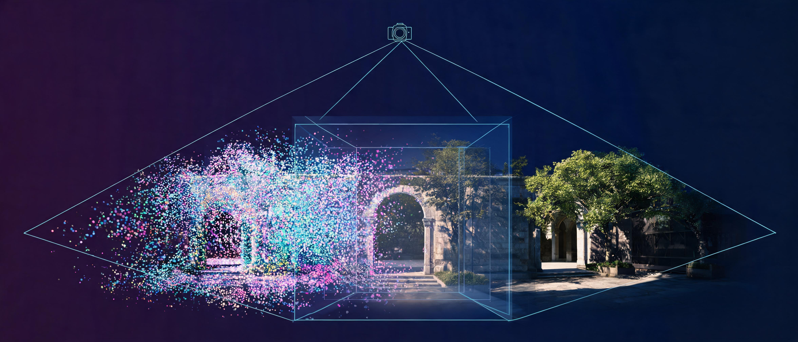
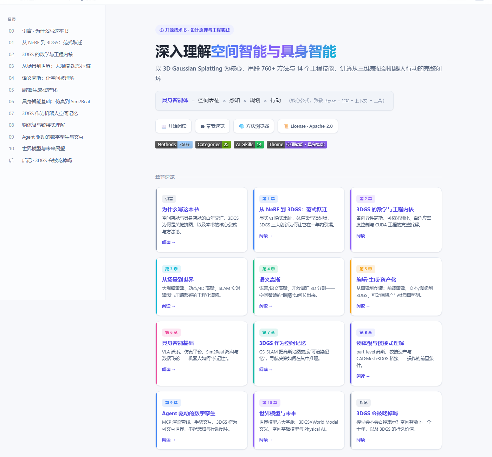

<div align="center">



# Awesome Gaussian Skills

### The Most Comprehensive 3D Gaussian Splatting Catalog — 819+ Methods, 23 Categories, Interactive Explorer

**You shouldn't search 20 repos for 3DGS papers. This is the only one you need.**

[](https://github.com/jaccen/Awesome-Gaussian-Skills/stargazers)
[](https://jaccen.github.io/Awesome-Gaussian-Skills/)
[](references/3dgs-methods-overview.md)
[](skills/)
[](skills/3dgs-code-reviewer/)
[](LICENSE)
[](CONTRIBUTING.md)

[English](README.md) | [中文](README_CN.md)

</div>

## Why This Repo?

Other awesome lists give you paper titles. **We give you paper titles + an AI toolkit that makes you faster.**

| What You Need | Other Lists | This Repo |
|---------------|-------------|-----------|
| Browse papers | Static markdown table | [Interactive explorer](https://jaccen.github.io/Awesome-Gaussian-Skills/): search, filter, sort |
| Compare methods | Open 2 papers side by side | 10+ dimension auto-comparison |
| Avoid code bugs | Discover after submission | 104 known bug pattern detection |
| Design experiments | Guess baselines & ablations | Venue-tailored experiment plan |
| NeRF → 3DGS | Trial-and-error porting | Step-by-step migration guide |
| CAD ↔ 3DGS | No coverage | 40+ method conversion pipeline |
| Patent filing | Manual from scratch | Auto-generated claims & specs |

## Live Demo

**[Try the Interactive Method Explorer →](https://jaccen.github.io/Awesome-Gaussian-Skills/)**

Search 819+ Methods instantly, filter by category, sort by citations, click any method card for details.

## 📖 Online Book: Spatial & Embodied Intelligence (New!)

> ** NEW (Jul 2026)** — A full open-source technical book,  built around **3D Gaussian Splatting** as the spine and weaving together **spatial intelligence** and **embodied intelligence** into one closed loop: *representation → perception → planning → action*.

**[📖 Read the Book →](https://jaccen.github.io/Awesome-Gaussian-Skills/spatial-embodied-intelligence.html)**

<div align="center">



</div>

**Core formula** (echoing `Agent = LLM + Context + Tools`):

> **Embodied Agent = Spatial Representation × Perception × Planning × Action**

**What's inside — 12 chapters, every method name anchored to this repo's real data (819+ Methods, 23 categories, 15 skills), zero fabrication:**

| # | Chapter | Focus |
|---|---------|-------|
| 引言 | Why this book | Why 3DGS is the key puzzle piece of Physical AI |
| CH 01 | NeRF → 3DGS: A paradigm leap | Explicit vs implicit, the three innovations, the alpha-compositing formula |
| CH 02 | The math & engineering core | Anisotropic Gaussians, differentiable rasterization, adaptive density control, CUDA |
| CH 03 | From scene to world | Large-scale, dynamic/4D, GS-SLAM, compression & deployment |
| CH 04 | Semantic Gaussians | CLIP/DINO feature distillation, open-vocabulary 3D segmentation |
| CH 05 | Editing · Generation · Asset-ization | Feed-forward reconstruction, SDS generation, animatable assets, PBR relighting |
| CH 06 | Embodied intelligence basics | VLA lineage (RT/π0/GR00T/ReconVLA), simulation, Sim2Real |
| CH 06 | 3DGS as robot spatial memory | GS-SLAM, map-as-renderer, three tiers of spatial memory |
| CH 08 | Object-level & articulated understanding | Part-level Gaussians, URDF bridging, the CAD·Mesh·3DGS triangle |
| CH 09 | Agent-driven digital twins | MCP rendering pipeline, gesture interaction, the perception-action loop |
| CH 10 | World models & the future | Six schools of world models, 3DGS×World Model, spatial foundation models, Physical AI |
| 后记 | Will 3DGS be eaten? | Why explicit representations will be compressed, not consumed |

Each chapter ends with hands-on exercises and links back to the repo's method tables, `references/`, and skills — so reading the book and doing the engineering are one seamless flow.

**Highlights you won't find in a paper list:**
- The six schools of world models (2026 taxonomy) and where 3DGS sits as the *only* representation that is simultaneously renderable, differentiable, and editable.
- How `GS-World`, `ManiGaussian`, and `OrbiSim` turn 3DGS into a differentiable simulation engine.
- A three-tier model of robot spatial memory (geometric → appearance → semantic) and where current GS-SLAM actually stands.

<details>
<summary><strong>Why we wrote it (and how it relates to this repo)</strong></summary>

This book is the *narrative layer* over the repo's *data layer*. The repo gives you 819+ method names, abstracts, and 15 engineering skills — but not the through-line that connects them. The book supplies that through-line: it argues *why* 3DGS became the bridge between spatial intelligence and embodied intelligence, and walks every chapter back to concrete methods and skills you can use today. Read the book to understand the map; use the repo to ship the territory.

</details>

## What's New (Aug 2026)

Latest update (Sep 4): **v0.8.3 — Dynamic Scene Survey Integration: 23 New Methods**. Knowledge base expanded from 801→819 verified methods. Added 23 arXiv-verified dynamic scene reconstruction methods from survey paper (连振晗 et al., J CAD & CG, Jan 2026), spanning 3 categories: deformation field (LoopGaussian, CoGS, CD-GS, PGED, GPS-Gaussian, MoDGS, MoDec-GS, SpectroMotion, BARD-GS, GauFRE, ReconDreamer++), sparse-control deformation (SP-GS, Video-3DGS, SplineGS), 4D Gaussian primitive (Real-time 4DGS, PVG, 4D-rotor GS), and per-frame inter-frame transfer (3DGStream, Dual-GS, STC-GS, IGS, GFlow, DynOMo). Dynamic & 4D category: 75→97. New `references/dynamic-datasets.md` (11 datasets) and expanded `benchmark-data.md` (MS-SSIM/VMAF/FID metrics + 4 performance comparison tables). Experiment planner skill updated with dynamic scene design guide. See [changelog/2026-09-04.md](changelog/2026-09-04.md).

Previous (Sep 2): **v0.8.2 — Daily Update: 11 New Methods**. Knowledge base expanded from 790→801 verified methods. New additions span 7 categories: **BRF-GS** (hyperspectral BRDF modeling with 3DGS), **SMG** (ECCV 2026, semantic motion graph for dynamic GS), **VCAR** (ACM MM 2026, training-free 3DGS segmentation), **RealCAD** (real-world image to CAD reconstruction), **ObjectSplat** (object-level mesh splatting), **CapFrame** (ECCV 2026, text-instructed viewpoint localization), **Amortized Anchor Refinement** (continuous-time 4D reconstruction), **ATGS** (SIGGRAPH 2026, anchored temporal GS for long volumetric video), **CausalSplat** (hierarchical causal reasoning in 3DGS), **VoroTracing** (623 FPS differentiable ray tracing), **Lucida** (Real-to-Sim composable scene modeling). All arXiv IDs verified, data CI passed. See [changelog/2026-09-02.md](changelog/2026-09-02.md).

Previous (Aug 23): **v0.8.1 — Daily Update: 7 New Methods**. Knowledge base expanded from 783→790 verified methods. New additions span 6 categories: **LEGO** (ECCV 2026, hierarchical language GS with LLM spatial reasoning), **OutLangSplat** (UAV outdoor open-vocabulary 3D language GS), **ESVR** (IEEE VIS 2026, 3D ellipsoid sparse volume rendering with 4 orders of magnitude compression), **TRACE-GS** (sparse-view 3DGS via privileged geometric conditioning), **RORA** (single-video-to-articulated-object pipeline with Unreal Engine deployment), **OVOW** (ECCV 2026, monocular video to instance-level 4D mesh for physics simulation), **Super-Gaussian** (interactive 3DGS scene editing with VR NLI visualization). All arXiv IDs verified, data CI passed. See [changelog/2026-08-23.md](changelog/2026-08-23.md).

Previous (Aug 7): **v0.8.0 — Platform Upgrade (P0+P1+P2)**. Knowledge layer: single source of truth (`data/methods.json`, 783 methods, 23 categories) with data CI; 5 fabricated entries purged; 14 arXiv-verified frontier methods added. Capability layer: true-3DGS render loop (gsplat via HTTP-served PLY), server-authoritative scene persistence, real PLY/SPLAT export, 5 distinct prune strategies, grid-accelerated ray query, runtime arg validation, WS origin allowlist, 21 unit tests. Platform layer: Benchmark arena (`bench/`), skill orchestration contracts (`skills/_contracts/`), Router manifest loader (`scripts/router_load.py`). 13 core MCP tools (all real) + 13 experimental (gated by `INCLUDE_EXPERIMENTAL=1`). See [changelog/2026-08-07.md](changelog/2026-08-07.md).

Previous (Jul 26): **v0.5.1 — Full Method Audit & 14 New Methods**. Now 789+ Methods (775 verified unique baseline + 14 new). Full re-audit across 11 source files; all method counts unified to 789+. New additions: **GrainGS** (dynamic, 36.98 dB / 435.6 FPS / 4.67 MB), **GLAM-SLAM** (IROS 2026, outdoor decoupled SLAM), **SubSplat** (subpixel feed-forward), **ATSplat** (adaptive 3D tokens, 1136 FPS), **3D-GIMP** (3DGS inpainting), **LB-Edit** (7× lower editing latency), **FlexiAvatar** (ECCV 2026, visible-body-only optimization), **ZeroSplat** (ECCV 2026, training-free segmentation), **CaT-GS** (CVPR 2026, 10× faster rendering), **FF-ProCams** (projector-camera inverse rendering), **i3dgs** (SIGGRAPH 2026, large-scale unordered), **VIGS-SLAM** (ECCV 2026, iPhone real-time), **ECoNGS** (IEEE VIS 2026, volume visualization), **AniGS** (scene-level animation via diffusion prior). +MoDE/MoE-GS code link. Previous (Jul 24): v0.5.0 MCP Protocol Implementation. Previous (Jul 23): v0.4.3 ICML 2026 & Material/Provenance Wave — **GaussTrace** (ICML 2026), **GADA** (ICML 2026), **InvSplat**, **MGM**, **DualPhys-GS**, **StereoGS**. v0.4.4 added 3dgs-training-debugger skill (60+ runtime patterns).

| Method | Venue | Category | One-Line Innovation |
|--------|-------|----------|-------------------|
| **Proxy-GS** | CVPR 2026 Oral | Acceleration | Lightweight proxy model for 2.5x speedup with no accuracy loss |
| **Z-Order GS** | CVPR 2026 Oral | Feed-Forward | Z-order Morton curve + sparse attention O(N²)→O(N log N) |
| **3DReflecNet** | CVPR 2026 Best Paper Candidate | Cross-Domain | 120K+ objects, 48 material combos, 3 failure modes |
| **Flux-GS** | ECCV 2026 | Acceleration | Flux-based Gaussian splatting for real-time rendering |
| **AnchorSplat** | ECCV 2026 | Optimization | Anchor-driven splatting with efficient density control |
| **ASSEMCAD** | ECCV 2026 | CAD | Assembly-aware CAD reconstruction from 3DGS |
| **WildSplat** | ECCV 2026 | Robustness | In-the-wild scene reconstruction with transient object removal |
| **NoDrift3R** | ECCV 2026 | SLAM | Drift-free dense 3D reconstruction via point map regression |
| **Axis-Shared Rasterization Accelerator** | ISCA 2026 | Acceleration | Hardware accelerator with axis-shared tiled rasterization |
| **Prune Wisely** | — | Optimization | 90% Gaussian pruning via DoG importance criterion |
| **Provable Pruning via Coresets** | — | Optimization | Coreset-based provable Gaussian pruning with bounded error |
| **StreamLoD-GS** | — | Streaming | LoD-based progressive streaming with view-dependent quality |
| **CADDreamer** | CVPR 2025 Highlight | CAD | Text/sketch → CAD B-rep generation |
| **GaussTrace** | ICML 2026 | Security | 3DGS provenance analysis via LLM reasoning for IP forensics |
| **GADA** | ICML 2026 | Feed-Forward | Geometry-aware deformable aggregation, 2.13× faster FPS |
| **InvSplat** | arXiv 2026 | Feed-Forward | Inverse feed-forward splatting with intrinsic PBR materials |
| **MGM** | arXiv 2026 | Relighting | Large material Gaussian model for relightable 3D generation |
| **DualPhys-GS** | arXiv 2026 | Robustness | Dual physics-guided 3DGS for underwater reconstruction |
| **StereoGS** | 2026 | Acceleration | Energy-efficient hardware stereoscopic GS rendering processor |

<sup>Full changelog: [`changelog/`](changelog/)</sup>

## Quick Start

Each skill is a standalone SKILL.md file — copy it to your Agent's skills directory.

**3 commands to your first AI-powered 3DGS workflow:**

```bash
git clone https://github.com/jaccen/Awesome-Gaussian-Skills.git

# Option 1: Claude Code
cp -r Awesome-Gaussian-Skills/skills/* .claude/

# Option 2: Cursor
cp -r Awesome-Gaussian-Skills/skills/* .cursor/rules/

# Option 3: One-Click Install
curl -sSL https://raw.githubusercontent.com/jaccen/Awesome-Gaussian-Skills/main/scripts/setup.sh | bash
```

Then ask your Agent: *"Compare 3DGS and 2DGS rendering formulations"*

## Knowledge Base (819+ Methods, 23 Categories)

| Group | Categories | Key Topics |
|-------|-----------|------------|
| **Core Representations** | Foundation, Antialiasing, Optimization, Surface/Rendering, Image Rep. | 3DGS, 2DGS, Scaffold-GS, Mip-Splatting, GaussianImage |
| **Efficiency & Scale** | Compression, Acceleration, Large-Scale, Feed-Forward | Compact-3DGS, BlitzGS, HiGS, VEDAL, VG²GT |
| **Understanding & Semantics** | Language/Semantic, Generation, Autonomous Driving | LangSplat, DreamGaussian, StreetNVS |
| **Dynamic & Spatial** | Dynamic, HDR, SLAM, Sparse-View, Spatial Intelligence | DSD-GS, WebSpline, GGD-SLAM, Holi-Spatial, Spatial-TTT |
| **Applications** | Human/Avatar, Editing, Relighting, CAD, Cross-Domain, Simulation, Robotics, +14 more | AlbedoEdit, KDH-CAD, LEGS, TIDES, 3DEditSafe |

> Download full database: [CSV](3dgs-methods-overview.csv) | Full analysis: [references/3dgs-methods-overview.md](references/3dgs-methods-overview.md)

<details>
<summary><strong>Full Category Table (23 categories)</strong></summary>

**Core Representations**

| Category | Description | Methods |
|----------|-------------|---------|
| Foundation (40) | Core 3DGS representations and basic variants | 3D Representation Survey, 3DGEER, 3DSGS |
| Optimization (76) | Training objectives, density control, convergence | AdaGScale, AdpSplit, ArtifactWorld |
| Surface & Rendering (50) | Surface extraction and rendering-formulation innovation | 2D-SuGaR, 3DSS, AmbiSuR |

**Efficiency & Scale**

| Category | Description | Methods |
|----------|-------------|---------|
| Compression & Streaming (43) | Lightweight, mobile, and progressive streaming | CAGS, Clustered Codebook VQ, CodecSplat |
| Acceleration (10) | Training and inference speedup | 3DGS\u00B3, Axis-Shared Rasterization Accelerator, DDF-GS |
| Large-Scale (20) | City-scale and distributed scene management | BlitzGS, CaT-GS, City-Level 3D Surface |
| Feed-Forward (67) | Generalizable single-pass reconstruction (incl. foundation models) | AdaptSplat, AnchorSplat, AnyCity |

**Understanding & Semantics**

| Category | Description | Methods |
|----------|-------------|---------|
| Language & Semantic (37) | Open-vocabulary 3D understanding and language fields | 3D-GIMP, Consistent Scene Understanding in 3DGS, DGSG-Mind |
| Generation (27) | Text/condition-driven 3D/4D generation | AniGen, AnySurf, AssetGen |
| Autonomous Driving (33) | Driving scene reconstruction and simulation | 3DGS Safety Evaluation for AD, Asset Harvester, CGGS |

**Dynamic & Spatial**

| Category | Description | Methods |
|----------|-------------|---------|
| Dynamic & 4D (97) | 4D Gaussians, temporal deformation, physics-integrated dynamics | 3DGS³, AniGS, ClipGStream |
| HDR & Relighting (27) | HDR capture, relightable and material-aware Gaussians | AlbedoEdit, Ambient-Robust IR, DiffAdapt4DSI |
| SLAM (40) | Simultaneous localization and mapping | 2DGS-SLAM, Anchor3R, Anythingreality |
| Sparse-View (21) | Few-shot and sparse-view reconstruction | DropAnSH-GS, FrameTwin, GeoQuery |
| World Models & Spatial Intelligence (8) | 3D spatial reasoning, world modeling | ABot-3DWorld 0, APEIRIA, FlashWorld |

**Applications & Cross-Domain**

| Category | Description | Methods |
|----------|-------------|---------|
| Human & Avatar (43) | Animatable human and avatar reconstruction | ArtMesh, CapTalk, COSY |
| Editing (47) | Interactive and text-guided scene editing | BEA-GS, Capacity-Controlled Stylization, DeSplat |
| CAD & Reverse Engineering (20) | CAD fitting, B-rep reconstruction, reverse engineering | 3DCodeBench, ASSEMCAD, BRepCLIP |
| Cross-Domain (47) | Medical, underwater, remote sensing and other domains | 3DTV, Aes3D, AsyncEvGS |
| Simulation (11) | Physics simulation and surrogate models | 3DThinkVLA, AGILE, ArtiTwinSplat |
| Embodied AI & Robotics (30) | Grasping, manipulation, navigation, digital twins | 3DGS Demo Synthesis (IL), ArtGS, Forecast-GS |
| Robustness (11) | In-the-wild and degradation-robust reconstruction | 3DReflecNet, DelowlightSplat, DualPhys-GS |
| Security (13) | Watermarking, copyright, forgery detection | 3DEditSafe, 4D-GSW, BitC-3DGS |

</details>

## 15 AI-Powered Skills

| # | Skill | What It Does | Example |
|---|-------|-------------|---------|
| 1 | [`3dgs-paper-reader`](skills/3dgs-paper-reader/) | Read any 3DGS paper, extract structured insights | "帮我读一下 2401.01345" |
| 2 | [`3dgs-method-compare`](skills/3dgs-method-compare/) | Compare variants across 10+ dimensions | "对比 3DGS 和 2DGS 的渲染公式差异" |
| 3 | [`3dgs-code-reviewer`](skills/3dgs-code-reviewer/) | Catch 104 known 3DGS implementation bugs | "审查我的 CUDA 渲染 kernel" |
| 4 | [`3dgs-experiment-planner`](skills/3dgs-experiment-planner/) | Design experiments for CVPR/SIGGRAPH/TVCG | "帮我设计消融实验" |
| 5 | [`nerf-to-3dgs-migrator`](skills/nerf-to-3dgs-migrator/) | Migrate NeRF methods to 3DGS step-by-step | "hash encoding 怎么迁移到 3DGS？" |
| 6 | [`cad-mesh-3dgs`](skills/cad-mesh-3dgs/) | Bridge CAD/Mesh/3DGS — 40+ conversion methods | "3DGS模型怎么提取高质量mesh？" |
| 7 | [`cg-paper-writing`](skills/cg-paper-writing/) | Write papers for CVPR/SIGGRAPH/TVCG with adversarial review | "帮我写论文引言" |
| 8 | [`3dgs-visualizer`](skills/3dgs-visualizer/) | Publication-quality radar charts, timelines, heatmaps | "画一个3DGS方法对比雷达图" |
| 9 | [`3dgs-engineering-guide`](skills/3dgs-engineering-guide/) | Deploy 3DGS from research to production (10 industry tracks) | "怎么部署3DGS做自动驾驶仿真？" |
| 10 | [`patent-software-ip`](skills/patent-software-ip/) | Generate patent applications & software copyrights | "生成专利申请文件" |
| 11 | [`3dgs-spatial-agent`](skills/3dgs-spatial-agent/) | Agent-driven 3D scene reasoning, CAD extraction, editing | "从3DGS中提取椅子的CAD模型" |
| 12 | [`3dgs-mcp-renderer`](skills/3dgs-mcp-renderer/) | MCP-controlled Three.js/3DGS rendering bridge | "从上方看这个场景" |
| 13 | [3dgs-articulated-reasoner](skills/3dgs-articulated-reasoner/) | Articulated object reasoning and digital twin | "打开抽屉" |
| 14 | [3dgs-compression-deploy](skills/3dgs-compression-deploy/) | Compress & deploy 3DGS (quantize, prune, VQ, stream, Web/Mobile) | "3DGS模型怎么压缩到10MB？" |
| 15 | [3dgs-training-debugger](skills/3dgs-training-debugger/) | Diagnose training failures: OOM, NaN, divergence, artifacts (60+ runtime patterns) | "训练OOM了怎么办？" |

Works with **Claude Code**, **Cursor**, **Windsurf**, and other AI Agent frameworks.

## Visualization Samples

Generated by `3dgs-visualizer` — see [`Test/`](Test/) for full-resolution files.

| Radar Chart | Metrics Bar Chart |
|:---:|:---:|
|  |  |

| Quality vs Speed | Metrics Heatmap |
|:---:|:---:|
|  |  |

## Research Innovation Highlights

> Derived from systematic gap analysis across 819+ Methods.
> Target venues: TVCG / CGF / CAD / T-RO / IJCV / ACM TOG.

<details>
<summary><strong>I-01. Part-Aware Alpha-Compositing for Articulated Objects</strong></summary>

**Problem:** Standard alpha-compositing causes color bleeding at part boundaries of articulated objects. ULF-Loc (CVPR 2026) exposed this feature bias, but no rendering-formulation-level fix exists.

**Approach:** Extend alpha-compositing with part-aware opacity modulation: C(θ) = Σ Tᵢ · αᵢ · ω_{p(i)}(θ) · cᵢ(θ), where ω penalizes penetration and joint violations, making inter-part penetration regions automatically transparent.

**Path:** 1) Build on gsplat rasterizer. 2) Add FK layer for articulated objects (URDF). 3) Compute penetration/joint violation via SDF. 4) Train on Articulate-100.

**Target:** SIGGRAPH / ACM TOG / TVCG
</details>

<details>
<summary><strong>I-02. Geometry-Consistent Flow World Model for Manipulation</strong></summary>

**Problem:** Flow-based world models (RoboFlow4D) predict dense 3D flows but lack geometric consistency — predicted flows can violate object rigidity and physical constraints.

**Approach:** Couple 3D flow prediction with scene graph constraints: rigidity loss for static objects, articulation loss for joints, support-relation constraints for stacking.

**Path:** 1) Extend RoboFlow4D. 2) Scene graph parser via OpenMask3D. 3) Geometric regularizer. 4) Train on LIBERO + RoboCasa.

**Target:** IJCV / T-RO / RSS
</details>

<details>
<summary><strong>I-03. Multi-Scale Occupancy-Gaussian Bidirectional Bridge for Driving</strong></summary>

**Problem:** Occupancy (SparseWorld, DOV) is the driving world model standard; 3DGS provides superior rendering. No differentiable bridge exists between them.

**Approach:** Bidirectional conversion: Occ→3DGS (learned position+scale predictor from occupancy+semantics) and 3DGS→Occ (differentiable sparse convolution pooling). Joint backbone for unified prediction+rendering.

**Path:** 1) Backbone: SparseWorld-TC. 2) Occ→3DGS module. 3) 3DGS→Occ module. 4) Training: nuScenes, Waymo.

**Target:** TVCG / T-ITS / CVPR
</details>

<details>
<summary><strong>6 more innovation highlights (I-04 to I-10)</strong></summary>

- **I-04. Solid Geometry Neural-Symbolic Reasoning**: VLM + Z3/SMT formal verifier in iterative refinement loop. Target: Pattern Recognition / AAAI.
- **I-05. Embodied Spatial Memory**: Hippocampus-inspired 3DGS scene graph + Perceiver compressor + importance-weighted forgetting. Target: T-RO / IJCV.
- **I-06. Differentiable Physics Engine**: SDF-based contact + differentiable KKT contact solver + Coulomb friction for manipulation. Target: ACM TOG / SIGGRAPH.
- **I-06. Tactile-Visual Spatial Fusion**: GelSight → contact geometry maps → 3D scene projection → cross-attention fusion. Target: T-RO / ICRA.
- **I-08. Panoramic Spatial World Model**: Spherical visual panorama + BEV semantic + affordance + spatial relation graph for "imagine then navigate". Target: ECCV / CVPR.
- **I-09. Code-as-Spatial-Vocabulary**: VLM generates Three.js code → render → extract spatial annotations → fine-tune VLM. Target: CVPR / NeurIPS.
- **I-10. Hyperbolic Cross-Modal Distillation**: Poincare ball distillation for image→point-cloud hierarchical feature transfer. Target: T-MM / T-IP.

</details>

## Roadmap

- [x] v0.1 — Initial release with 6 core skills (Apr 2026)
- [x] v0.2 — `3dgs-visualizer` + Text2Word demo (May 2026)
- [x] v0.3 — Knowledge base 665->789+ Methods, 25 Categories, 101+ bug patterns, 12 skills (Jun 2026)
- [x] v0.3.6 — Spatial intelligence wave: 680->639+ methods, +10 new methods (FastGS, Holi-Spatial, Spatial-TTT, etc.), Dimension 11, Anthropic standard alignment (Jun 25, 2026)
- [x] v0.3.6 — CVPR 2026 representative papers: 690->639+ methods, +23 verified new methods, all 13 skills updated (Jun 28, 2026)
- [x] v0.4.0 — Router Architecture Expansion: cg-paper-writing + 3dgs-engineering-guide → Router + manifest.yaml + static/; 3dgs-code-reviewer Self-Check Loop; cg-paper-writing Stage Gates; 3 Router skills total (Jul 2, 2026)
- [x] v0.4.1 — ECCV & ISCA 2026 Wave: +Flux-GS, AnchorSplat, ASSEMCAD, WildSplat, NoDrift3R (ECCV 2026), Axis-Shared Rasterization Accelerator (ISCA 2026), Provable Pruning via Coresets; 639+ methods (Jul 9, 2026)
- [x] v0.4.2 — SIGGRAPH & MICCAI 2026 Wave: +DP-Splat, MoE-GS/MoDE (TPAMI 2026), HyperGS, MAC-Splat (ECCV 2026), Track2Map (MICCAI 2026), PEAR (SIGGRAPH 2026), CoSAG, HoloTetSphere (ECCV 2026), SalientGS; 639→789+ Methods, +3dgs-compression-deploy skill, 14 skills total (Jul 14, 2026)
- [x] v0.4.3 — ICML 2026 & Material/Provenance Wave: +GaussTrace (ICML 2026), GADA (ICML 2026), InvSplat, MGM, DualPhys-GS, StereoGS; 660→789+ Methods, +3 bug patterns (108+ total), MCP roadmap v0.2.3 (Jul 23, 2026)
- [x] v0.4.4 — Training Debugger Skill: +1 skill (3dgs-training-debugger, 60+ runtime patterns, VRAM management, convergence analysis), 14→15 skills total (Jul 23, 2026)
- [ ] v0.4 — `3dgs-spatial-agent` enhancements (knowledge-constrained CAD, DDF-GS ray query)
- [x] v0.5.0 — MCP Protocol Implementation: 24-tool MCP server (mcp-server/), Three.js WebSocket renderer, 24-pattern voice intent mapper, headless mode, voice demo (Jul 24, 2026)
- [x] v0.5.1 — Full Method Audit & 14 New Methods: 775 verified unique baseline + 14 new = 789+ methods; all method counts unified across 11 source files; +GrainGS, GLAM-SLAM, SubSplat, ATSplat, 3D-GIMP, LB-Edit, FlexiAvatar, ZeroSplat, CaT-GS, FF-ProCams, i3dgs, VIGS-SLAM, ECoNGS, AniGS (Jul 26, 2026)
- [x] v0.8.0 — Platform Upgrade (P0+P1+P2): single source of truth (data/methods.json, 783 methods, 23 categories, data CI); 5 fabricated entries purged + 14 arXiv-verified frontier methods; true-3DGS render loop (gsplat via HTTP-served PLY); server-authoritative scene persistence; real PLY/SPLAT export; 5 prune strategies; grid-accelerated ray query; runtime arg validation; WS origin allowlist; 21 unit tests + 2 CI workflows; Benchmark arena (bench/); skill orchestration contracts (skills/_contracts/); Router manifest loader (scripts/router_load.py); 13 core MCP tools + 13 experimental (Aug 7, 2026)
- [x] v0.8.1 — Daily Update: 7 new arXiv-verified methods (LEGO, OutLangSplat, ESVR, TRACE-GS, RORA, OVOW, Super-Gaussian); 783→790 methods; 6 categories updated; all data carriers in sync (Aug 23, 2026)
- [x] v0.8.2 — Daily Update: 11 new arXiv-verified methods (BRF-GS, SMG, VCAR, RealCAD, ObjectSplat, CapFrame, Amortized Anchor Refinement, ATGS, CausalSplat, VoroTracing, Lucida); 790→801 methods; 7 categories updated; all data carriers in sync (Sep 2, 2026)
- [x] v0.8.3 — Dynamic Scene Survey Integration: 23 new arXiv-verified methods from 连振晗 et al. survey (J CAD & CG, Jan 2026); 801→819 methods; Dynamic & 4D 75→97; +dynamic-datasets.md (11 datasets); +benchmark-data.md metrics (MS-SSIM/VMAF/FID) and 4 performance tables; experiment-planner skill updated (Sep 4, 2026)
- [ ] v1.0 — CI/CD integration + multi-framework official listings
- [ ] v2.0 — Agent-to-Agent collaboration (multi-agent paper discussion)

<sup>Full version history: [`changelog/`](changelog/)</sup>

## Architecture

```
Awesome-Gaussian-Skills/
├── data/                      # Single source of truth (methods.json, categories.json)
├── skills/                    # 15 AI Agent skills (SKILL.md format)
│   ├── _contracts/            # Inter-skill I/O schemas (paper-insight, comparison-report, experiment-plan)
│   ├── 3dgs-paper-reader/     # Paper reading & summarization
│   ├── 3dgs-method-compare/   # Method comparison engine (Router)
│   ├── 3dgs-code-reviewer/    # Code review (104 bug patterns)
│   ├── 3dgs-experiment-planner/ # Experiment design
│   ├── nerf-to-3dgs-migrator/ # NeRF→3DGS migration
│   ├── cad-mesh-3dgs/         # CAD/Mesh/3DGS bridge
│   ├── cg-paper-writing/      # CG paper writing assistant (Router)
│   ├── 3dgs-visualizer/       # Research visualization
│   ├── 3dgs-engineering-guide/ # Engineering deployment (Router)
│   ├── patent-software-ip/    # Patent & copyright generation
│   ├── 3dgs-spatial-agent/    # Spatial intelligence agent
│   ├── 3dgs-mcp-renderer/     # MCP rendering bridge
│   ├── 3dgs-articulated-reasoner/ # Articulated reasoning & digital twin
│   ├── 3dgs-compression-deploy/  # Compression & deployment
│   └── 3dgs-training-debugger/  # Training failure diagnosis
├── mcp-server/                # MCP server v0.8.0 (13 core + 13 experimental tools, gsplat render loop, HTTP+WS :9842)
├── bench/                     # Benchmark arena (metrics.py, run_eval.py, leaderboard.json)
├── scripts/                   # build_knowledge_base.py, validate_knowledge_base.py, router_load.py, validate_skill_contract.py
├── studio/                    # SplatVerse Studio (bridge + web)
├── docs/                      # GitHub Pages interactive explorer
├── references/                # Knowledge base (819+ Methods, 23 Categories)
├── Test/                      # Visualization samples
├── changelog/                 # Version history
└── assets/                    # Project images
```

Each skill follows the **SKILL.md standard**, compatible with **Claude Code** (`.claude/`), **Cursor** (`.cursor/rules/`), **Windsurf**, and other AI Agent frameworks.

## SplatVerse Studio: Short Video Creation

SplatVerse Studio integrates **3D Gaussian Splatting** with a short-drama pipeline powered by the **Toonflow** engine, letting you go from text scripts to 3DGS-rendered video scenes.

### Architecture

```
Toonflow Engine (:10588)          SplatVerse Studio
┌──────────────────────┐         ┌───────────────────────────┐
│  Script → Assets →    │  REST   │  Bridge (:10590)          │
│  Storyboard → Video   │◄──────►│  ├─ Project Browser       │
│                       │         │  ├─ Render Studio          │
│  Vendor: 3dgs-renderer│         │  ├─ MCP Tools (25 tools)  │
└──────────────────────┘         │  │  MCP Renderer (:9842)  │
                                  │  ├─ Pipeline (7 steps)     │
 MoneyPrinterTurbo (:8081)       │  │  ├─ Script Adaptation   │
┌──────────────────────┐         │  │  ├─ Storyboard          │
│  Online material →    │  REST   │  │  ├─ Toonflow Sync       │
│  TTS → FFmpeg → Video │◄──────►│  │  ├─ TTS Dubbing         │
│  Cross-platform post  │         │  │  ├─ Video Gen           │
└──────────────────────┘         │  │  ├─ FFmpeg Compose      │
                                  │  │  └─ Publish (MPT)       │
                                  │  Studio Web (:5173)        │
                                  └───────────────────────────┘
```

### Quick Start

**Prerequisites:** [Node.js ≥ 18](https://nodejs.org/) (Toonflow and MoneyPrinterTurbo are optional).

The one-click launcher starts everything automatically on first run:
checks Node.js, creates `.env` from `.env.example` if missing, runs `npm install`
if dependencies are missing, builds the MCP Server / Bridge binaries if needed, then
starts **Toonflow Studio (:10588)** (if found), **MCP 3D Renderer (:9842)**,
**Bridge Server (:10590)** and **Studio Web (:5173)**, health-checks every service,
and opens your browser.

#### Option A — Windows (double-click)

Download the project, then double-click **`start-all.bat`** in the project root.
That's it — all services start automatically and a browser opens at `http://localhost:5173`.

#### Option B — npm (any OS)

```bash
npm run start:all
```

#### Option C — PowerShell (Windows)

```powershell
powershell -NoProfile -ExecutionPolicy Bypass -File scripts/start-all.ps1
```

> **One-time manual step only needed for video generation:** set `LLM_API_KEY` in the
> generated `.env` (used for script/storyboard generation).
>
> Toonflow (optional, for the full video pipeline) is auto-detected from
> `../AI应用/Toonflow-app`, `../Toonflow-app`, `./Toonflow-app`, or `TOONFLOW_APP_DIR`.
> MoneyPrinterTurbo (optional, needs Docker) is started only when `MPT_ENABLED=true`
> in `.env`.

Useful flags: `-NoToonflow` skip Toonflow, `-NoMpt` skip MPT, `-NoBrowser` skip
auto-opening the browser, `-SkipInstall` skip `npm install`.

#### Minimal (no Toonflow)

If you only need the 3DGS rendering tools without Toonflow:

```bash
npm run dev    # MCP + Bridge + Web, no Toonflow
```

### Creating a Short Video: Step by Step

#### Step 1 — Write a Script in Toonflow

Open the Toonflow web app (typically at `http://localhost:10588`). Create a project, write a script, and generate storyboards. Each storyboard is a scene with:

- **Prompt** — text description for image/video generation
- **Duration** — scene length in seconds
- **Track** — scene grouping label

Toonflow's pipeline: `Text → Script → Assets (roles, scenes, props) → Storyboards → Video`

#### Step 2 — Browse Projects in Studio Web

Open `http://localhost:5173` and navigate to **Projects**. You'll see all Toonflow projects. Click a project to view its storyboards.

<details>
<summary>Example: Creating a test project via API</summary>

```bash
# Login to Toonflow
TOKEN=$(curl -s http://localhost:10588/api/login/login \
  -H "Content-Type: application/json" \
  -d '{"username":"admin","password":"admin123"}' | jq -r '.data.token')

# Create a script
curl -s http://localhost:10588/api/script/addScript \
  -H "Authorization: $TOKEN" \
  -H "Content-Type: application/json" \
  -d '{"name":"Forest Adventure","content":"# Forest Adventure\n## Scene 1...","projectId":1}'

# Add storyboards
curl -s http://localhost:10588/api/production/storyboard/batchAddStoryboardInfo \
  -H "Authorization: $TOKEN" \
  -H "Content-Type: application/json" \
  -d '{
    "scriptId": 1,
    "projectId": 1,
    "data": [
      {
        "prompt": "A misty forest at dawn, sunlight through trees",
        "videoDesc": "Dawn mist over ancient forest",
        "duration": 5,
        "track": "Scene 1",
        "state": "pending",
        "src": "",
        "shouldGenerateImage": 1,
        "associateAssetsIds": []
      }
    ]
  }'
```

</details>

#### Step 3 — Render Storyboards as 3DGS Scenes

Two rendering modes in **Render Studio** (`/render`):

| Mode | What it does | When to use |
|------|-------------|-------------|
| **Direct 3DGS Render** | Render a single scene from a text description or `.ply` file | Quick preview without Toonflow |
| **Batch Render from Toonflow** | Render multiple Toonflow storyboards as 3DGS scenes | Full short-video production |

For batch rendering, enter the Toonflow **Project ID** and **Storyboard IDs** (comma-separated), then click **Render Batch**. The Bridge fetches storyboards from Toonflow, builds 3DGS scenes via MCP Server, and renders each storyboard frame.

#### Step 4 — Monitor Render Progress

Render progress streams via SSE (Server-Sent Events). You'll see toast notifications in the top-right corner as each storyboard renders. The Dashboard shows recent render tasks with progress bars.

#### Step 5 — 3DGS as a Toonflow Vendor (Optional)

To use 3DGS rendering directly inside Toonflow's image/video generation:

```bash
# Copy the vendor adapter to Toonflow
cp studio/bridge/vendor/3dgs-renderer.ts ../AI应用/Toonflow-app/data/vendor/
```

This registers 3DGS as both an image model (single-frame render) and video model (multi-frame animation) in Toonflow's vendor system.

### Port Reference

| Service | Port | Description |
|---------|------|-------------|
| Toonflow Engine | 10588 | Short-drama creation (external app) |
| MCP Renderer | 9842 | WebSocket 3DGS renderer |
| Bridge Server | 10590 | REST API + SSE, Toonflow proxy |
| Studio Web | 5173 | Vue 3 SPA frontend |
| MPT API (Sidecar) | 8081 | MoneyPrinterTurbo FastAPI (optional; 8081 used when host 8080 is taken) |
| MPT Web UI | 8501 | MoneyPrinterTurbo Streamlit UI (optional) |

### Troubleshooting

- **"Toonflow engine not running"** — Start Toonflow: `npm run start:all` or manually `node data/serve/app.js` in the Toonflow directory
- **Projects page shows no storyboards** — Create a script first in Toonflow; storyboards belong to scripts
- **3DGS vendor not available in Toonflow** — Copy `studio/bridge/vendor/3dgs-renderer.ts` to Toonflow's `data/vendor/` directory

### MoneyPrinterTurbo (MPT) Integration

[MoneyPrinterTurbo](https://github.com/harry0703/MoneyPrinterTurbo) is integrated as an **optional HTTP API sidecar**, extending SplatVerse Studio with online material video generation, additional TTS voices, and cross-platform publishing. **Zero intrusion** — when `MPT_ENABLED=false` or `MPT_API_URL` is unset, the pipeline behaves exactly as before.

#### What MPT Adds

| Capability | Pipeline Step | Role |
|------------|---------------|------|
| **Extended TTS** | Step 4 (TTS) | Fallback when CosyVoice2 → Edge → SAPI all fail; adds Azure / SiliconFlow / ElevenLabs / Gemini voices |
| **Full Video Generation** | Step 6 (Compose) | Final fallback when 3DGS / Toonflow / video gen all produce no clips — uses Pexels / Pixabay / Coverr online materials |
| **Cross-Platform Publish** | Step 7 (Publish, new) | One-click publish to TikTok / Instagram / YouTube Shorts |

#### Frontend Entry

The Studio Web "Script → Video" page (`/pipeline`) ships a built-in MPT entry:

- **Config panel**: a "🚀 MoneyPrinterTurbo Integration" group at the bottom of the model config section — enable toggle, service URL, material source, default voice, plus a live connection status (Connected / Not connected). Saving writes the settings into `.env`.
- **Per-task options**: a "🚀 MoneyPrinterTurbo Fallback" block at the bottom of the input section — check "Video fallback" and "TTS fallback" to automatically degrade to MPT when any main-pipeline step (3DGS / Toonflow / TTS) fails; when MPT is enabled you can also pick an MPT voice and publish platforms (TikTok / YouTube / Instagram).

> Note: the bridge auto-loads the project-root `.env` at startup (dependency-free implementation, see `studio/bridge/src/load-env.ts`), so config saved from the UI takes effect **after the bridge restarts**. Launch the bridge from the project root (`npm run dev:bridge` or `scripts/start-dev.ps1`) to ensure the root `.env` is picked up.

#### Setup

```bash
# 1. Configure MPT (fill in at least one material API key)
cp mpt-config.example.toml mpt-config.toml
#    Edit mpt-config.toml — required: pexels.api_key or pixabay.api_key (both free)

# 2. Start MPT container
docker compose -f docker-compose.mpt.yml up -d

# 3. Verify MPT is running
curl http://localhost:8081/api/v1/tasks?page=1&page_size=1

# 4. Enable MPT in Studio .env
#    MPT_ENABLED=true
#    MPT_API_URL=http://localhost:8081
```

#### Configuration Reference

| Env Variable | Default | Description |
|--------------|---------|-------------|
| `MPT_ENABLED` | `false` | Enable/disable MPT integration |
| `MPT_API_URL` | (empty) | MPT FastAPI service URL |
| `MPT_MATERIAL_SOURCE` | `pexels` | Material source: `pexels` / `pixabay` / `coverr` / `local` |
| `MPT_DEFAULT_VOICE` | `zh-CN-XiaoxiaoNeural` | Default TTS voice name |

MPT-side settings (API keys for Pexels/Pixabay, TTS providers, LLM) go in `mpt-config.toml`, not `.env`. See `mpt-config.example.toml` for the full template.

#### API Endpoints

| Endpoint | Method | Description |
|----------|--------|-------------|
| `/api/pipeline/mpt/health` | GET | Check MPT service availability |
| `/api/pipeline/mpt/bgm` | GET | List MPT BGM library |
| `/api/pipeline/tasks/:id/publish` | POST | Publish video to platforms (`{ platforms: [{ name, title, tags }] }`) |

#### Creating a Task with MPT Fallback

```bash
curl -s http://localhost:10590/api/pipeline/tasks \
  -H "Content-Type: application/json" \
  -d '{
    "text": "In a quiet town, a kitten named HuaHua chats with a butterfly...",
    "title": "HuaHua Adventure",
    "style": "水彩",
    "videoRatio": "16:9",
    "enableTTS": true,
    "enableVideoGen": false,
    "enableMptFallback": true,
    "enableMptTTS": true,
    "mptVoiceName": "zh-CN-XiaoxiaoNeural",
    "publishPlatforms": [
      { "name": "tiktok", "title": "HuaHua Adventure", "tags": ["animation", "cat"] }
    ]
  }'
```

The 7-step pipeline: **Script Adaptation → Storyboard → Toonflow Sync → TTS (MPT fallback) → Video Gen → FFmpeg Compose (MPT fallback) → Publish (MPT)**

## Contributing

Contributions welcome! See [Contributing Guide](CONTRIBUTING.md).

[](https://github.com/jaccen/Awesome-Gaussian-Skills/graphs/contributors)

## Citation

```bibtex
@misc{awesome-gaussian-skills,
  author = {jaccen},
  title = {Awesome Gaussian Skills: 3D Spatial Intelligence Open-Source Toolbox for 3D Gaussian Splatting Research},
  year = {2026},
  url = {https://github.com/jaccen/Awesome-Gaussian-Skills}
}
```

## Acknowledgments

- [3D Gaussian Splatting](https://repo-sam.informatik.uni-halle.de/jkortner/gaussian-splatting/) — The foundational work
- [awesome-3D-gaussian-splatting](https://github.com/MrNeRF/awesome-3D-gaussian-splatting) — The awesome list that inspired this project
- [Awesome3DGS/3D-Gaussian-Splatting-Papers](https://github.com/Awesome3DGS/3D-Gaussian-Splatting-Papers) — Comprehensive paper collection
- All 3DGS researchers whose papers form our knowledge base

## License

Apache-2.0. See [LICENSE](LICENSE) for details.

## Sponsor & Community

If this project helps your research or work, consider supporting us!

<table>
<tr>
<td align="center">
<br>
<b>Sponsor / 打赏</b><br>
Buy us a coffee
</td>
<td align="center">
<br>
<b>Join Group / 加入社群</b><br>
3DGS research discussion
</td>
</tr>
</table>

## Star History

[](https://star-history.com/#jaccen/Awesome-Gaussian-Skills&Date)

<div align="center">

**If this project saves you time, please give it a star!**</div>